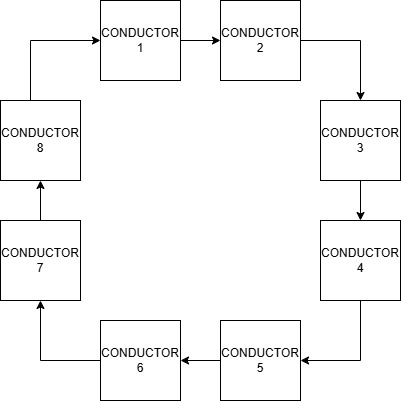
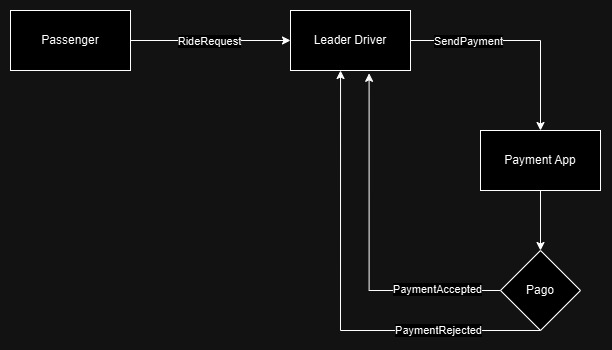

[](https://classroom.github.com/a/GAOi0Fq-)

|Alumno                   | Padrón |
|-------------------------|--------|
|Edgargo Francisco Saez   | 104896 |
|Tomás Vainstein Aranguren| 109043 |
|Fabio Sicca              | 104892 |

# TP2: Primera entrega de diseño

## Ejecución

Primero se inicializa la aplicación de pagos, para esto dentro de la carpeta 'payment_app' se debe ejecutar el siguiente comando:

`cargo run`

Luego se procede a levantar los conductores, comenzando desde los conductores comunes y ejecutando al final el líder. Dentro de la carpeta 'driver':

`cargo run <port> <pos_x> <pos_y>`

Por ejemplo, si en el archivo 'config.txt' se tienen a los drivers 6002, 6001 y 6000, se ejecutaría:

`cargo run 6002 5 9`

`cargo run 6001 8 10`

`cargo run 6000 0 0`

Finalmente se ejecutan los pasajeros. Dentro de la carpeta 'passanger':

`cargo run 9000 rides/ride9000.json`

`cargo run 9001 rides/ride9001.json`


## Aplicaciones

Se definen tres aplicaciones: una de conductores, una de pasajeros y otra de pagos.


## Esquema


## Diseño



En primera instancia se opta por utilizar el algoritmo de anillo para la elección de un nuevo líder en caso de que el mismo se desconecte.

## Actores

### Conductor
**Finalidad general:**
- Aceptar un viaje en rango, realizarlo e informar al conductor líder que terminó.

**Estado interno:**
- Esperando viaje, viajando


### Conductor Líder
**Finalidad general:**
- Deriva los pedidos de viaje a conductores que estén en el rango de salida y reserva los pagos informando a la app de pagos. 
- Quita conductores que estén caídos.
- Informa a los clientes que el viaje finalizó cuando le llega esta información del conductor a cargo del viaje.

**Estado interno:**
- Esperando viaje, viajando


### Pasajeros
**Finalidad general:**
- Encargados de pedir viajes al conductor líder.

**Estado interno:**
- Esperando viaje, pagando, viajando, terminado


### Pago
**Finalidad general:**
- Encargado de reservar y cobrar los montos de los viajes.
- Es la entidad que define si un pago es aceptado o rechazado y se lo informa al conductor líder.

**Estado interno:**
- Cobrando, finalizando

## Mensajes

| Message           | Sender       | Receiver     | Description                                             |
| ----------------- | ------------ | ------------ | ------------------------------------------------------- |
| RideRequest       | Passenger    | LeaderDriver | Sends coordinates and payment of new ride               |
| SendPayment       | LeaderDriver | PaymentApp   | Sends the trip payment to the payment ride              |
| PaymentRejected   | PaymentApp   | LeaderDriver | Informs that the payment was rejected                   |
| PaymentAccepted   | PaymentApp   | LeaderDriver | Informs that the payment was accepted                   |
| RideRequest       | LeaderDriver | Driver       | Sends coordinates to near starting point drivers        |
| InformLocation    | Driver       | LeaderDriver | Informs current location of the driver                  |
| RejectRide        | Driver       | LeaderDriver | Rejects ride offer                                      |
| AcceptRide        | Driver       | LeaderDriver | Accepts ride offer                                      |
| RideFinished      | Driver       | LeaderDriver | Informs that the ride has finished to the leader driver |
| RideFinished      | LeaderDriver | Passenger    | Informs that the ride has finished to the passenger     |
| PayRide           | LeaderDriver | Driver       | Pays ride to the driver                                 |
| Ping              | LeaderDriver | Driver       | Leader uses this message to check if driver is alive    |
| NewLeaderElection | Driver       | Driver       | Starts new leader election when previous leader dies    |



### Flujo de mensajes:

- Passenger → RideRequest → LeaderDriver
- LeaderDriver → SendPayment → PaymentApp
- PaymentApp → Payment Accepted/Rejected → LeaderDriver

—-------------------------------------------------------------------------------------------------------------------

**Pago rechazado:**
- El pasajero no puede realizar el viaje

**Pago aceptado:**
- Driver → InformLocation → LeaderDriver
- LeaderDriver → RideRequest → Driver (Envía una solicitud de viaje a un conductor cercano. Solo 1 recibe la oferta por vez, si la rechaza se envía a otro) (Si todos los de la zona rechazan? → Se va extendiendo el área)
- Driver → Accept/Reject Ride → LeaderDriver

—---------------------------------------------------------------------------------------------------------------------

**Rechazo de viaje:**
- LeaderDriver → RideRequest → Driver (Se le envía a otro conductor cercano)

**Aceptación de viaje:**
- Driver pasa a estado "Driving"(hace sleep)
- Driver → RideFinished → LeaderDriver
- LeaderDriver → PayRide → Driver
- Driver pasa a estado "Idle" (Esperando un nuevo viaje)

—---------------------------------------------------------------------------------------------------------------------

Finalmente los mensajes "Ping" y "NewLeaderElection" se relacionan con la elección de un nuevo líder en caso que éste
se desconecte.

### Estructuras de los mensajes

```rust
pub struct RideRequest {
    pub id: u16
    pub x_origin: u16,
    pub y_origin: u16,
    pub x_dest: u16,
    pub y_dest: u16,
}
```

* AcceptRide has same payload that RejectRide 
```rust
pub struct AcceptRide {
    pub id: u16,
    pub response: bool,
}
```

```rust
pub struct SendPayment {
    pub id: u16,
    pub amount: i32,
}
```

* PaymentRejected has same struct that PaymentAccepted
```rust
pub struct PaymentRejected {
    pub id: u16,
}
```

```rust
pub struct InformLocation {
    pub id: u16
    pub x: u16,
    pub y: u16,
}
```

```rust
pub struct PayRide {
    pub id: u16
    pub amount: i32
}
```

```rust
pub struct Ping {
    pub info: String
}
```

```rust
pub struct NewLeaderElection {
}
```

### Estructuras de los Actores

```rust
pub struct Passenger {
    /// The port of the passenger
    id: u16,
    /// The port of the leader (6000 for now)
    leader_port: u16,
    /// The actor that sends messages to the leader
    tcp_sender: Addr<TcpSender>,
    /// The list of rides (coordinates) that the passenger has to go to
    rides: Vec<Coordinates>,
    /// The channel to send a completion signal to the main function
    completion_signal: Option<Sender<()>>,
}
```

```rust
pub struct TcpSender {
    /// The write half of the TcpStream
    write: Option<WriteHalf<TcpStream>>,
}
```

```rust
pub struct Driver {
    /// The port of the driver
    pub id: u16,
    /// Whether the driver is the leader
    pub is_leader: Arc<RwLock<bool>>,
    /// Leader port
    pub leader_port: Arc<RwLock<u16>>,
    /// The connections to the drivers
    pub active_drivers: Arc<RwLock<HashMap<u16, (Option<ReadHalf<TcpStream>>, Option<WriteHalf<TcpStream>>)>>>,
    /// States of the driver
    pub state: Sates,
    /// Pending rides
    pub pending_rides: Arc<RwLock<HashMap<u16, RideRequest>>>,
    /// Connection to the leader or the Passenger
    pub write_half: Arc<RwLock<Option<WriteHalf<TcpStream>>>>,
}
```

## Protocolo

Para la conexión entre pasajeros, conductores y app de pagos utilizaremos sockets con el protocolo de transporte TCP. Los mensajes y sus payloads son los mostrados en la sección anterior del informe; su serialización y deserialización se realizan utilizando el framework serde.

## Casos de interés
- Aceptación del pago
- Rechazo del pago → El pasajero no puede realizar el viaje, pero puede llegar a realizar los siguientes
- Desconexión de un conductor antes de aceptar el viaje → Se da el viaje rechazado por el conductor
- Desconexión de un conductor luego de aceptar el viaje → El viaje quedara pendiente a la reconexion del conductor, para avisar al lider que el viaje finalizo.
- Desconexión de un pasajero antes de pagar → No se envía la solicitud de viaje
- No hay conductores en el rango de viaje → Se agranda el radio de búsqueda
- Desconexión del líder → Se procede a hacer una búsqueda de un nuevo líder utilizando el algoritmo de anillo y una vez elegido, éste recopila la información de pagos almacenada en la app de pagos y la información de los viajes almacenada en los otros conductores.

## Supuestos tomados

- La aplicación de pagos no se cae
- En caso que se rechace el pago, el viaje no se realiza
- Una vez que se empieza el viaje no se puede cancelar y termina si o si.


# TP 2: Entrega Final

## Esquema

El esquema de aplicaciones se mantiene igual al de la entrega inicial.


## Arquitectura

### Payment App

Esta aplicación lanza un puerto de escucha (7500) donde espera nuevas conexiones por parte del conductor líder o nuevo líder llegado el caso.
Al llegar una nueva conexión crea 3 actores: SocketReader, PaymentApp, SocketWriter.

**SocketReader:** Encargado de leer los mensajes que llegan por el socket TCP para formatearlo en un mensaje que el actor
PaymentApp entienda.

**PaymentApp:** Se encarga de procesar los mensajes de los pagos y enviar las respuestas al SocketWriter.

**SocketWriter:** Recibe las respuestas de PaymentApp, las serializa y las envía hacia el conductor líder.

### Passenger

Esta aplicación se conecta mediante TCP al conductor líder a quien le envía pedidos de viajes. Por otro lado, abre un puerto
de escucha en el puerto pasado por parámetro al ejecutar la aplicación, donde esperará la reconexión del nuevo líder si el
anterior se desconecta.
Contiene 2 actores: Passenger y TcpSender

**Passenger:** Contiene la lógica relacionada con los viajes.

**TcpSender:** Recibe los mensajes de Passenger para serializarlos y enviarlos hacia el conductor líder.

### Driver

Dependiendo si se trata del conductor líder o un conductor común su comportamiento varía. Si se trata del conductor líder
se conecta a los conductores y establece un puerto de escucha para que se conecten a él los pasajeros. Por otro lado, 
un conductor común sólo establece un puerto de escucha para que se conecte el conductor líder.

El conductor líder actúa como un servidor, comunicando las peticiones de los pasajeros con los conductores. Además es quien
se conecta a la aplicación de pagos para verificar la validez de los mismos.

Por útlimo, también se comunica mediante 'pings' con todos los conductores y viceversa.

## Algoritmo de decisión

Utilizamos el algoritmo del anillo para manejar la elección del nuevo
conductor líder cuando el actual se cae.

En el caso del diagrama podemos observar el flujo de elección cuando
se cae el primer conductor líder y se elige el próximo conductor
con id más alto.


## Mensajes

Modificamos algunos mensajes respecto a la primera entrega y agregamos algunos nuevos.

### Mensajes sobre el modelo

| **Message**             | **Sender**      | **Receiver**       | **Payload**                                                                                  | **Trigger**    |
|-------------------------|-----------------|-------------------|-----------------------------------------------------------------------------------------------|----------------|
| RideRequest             | Passenger       | LeaderDriver       | id: u16, x_origin: u16, y_origin: u16, x_dest: u16, y_dest: u16                              | Start actor    |
| SendPayment             | LeaderDriver    | PaymentApp         | id: u16, amount: i32                                                                         | RideRquest     |
| PaymentRejected         | PaymentApp      | LeaderDriver       | id: u16                                                                                      | SendPayment    |
| PaymentAccepted         | PaymentApp      | LeaderDriver       | id: u16                                                                                      | SendPayment    |
| RideRequest             | LeaderDriver    | Driver             | id: u16, x_origin: u16, y_origin: u16, x_dest: u16, y_dest: u16                              | PaymentAccepted|
| PositionUpdate          | Driver          | LeaderDriver       | driver_id: u16, position: (i32,i32)                                                          | RideRequest    |
| DeclineRide             | Driver          | LeaderDriver       | passenger_id: u16, driver_id: u16                                                            | RideRequest    |
| AcceptRide              | Driver          | LeaderDriver       | passenger_id: u16, driver_id: u16                                                            | RideRequest    |
| FinishRide              | Driver          | LeaderDriver       | passenger_id: u16, driver_id: u16                                                            | Time           |
| FinishRide              | LeaderDriver    | Passenger          | passenger_id: u16, driver_id: u16                                                            | Time           |
| PayRide                 | LeaderDriver    | Driver             | ride_id: u16, amount: u16                                                                    | FinishRide     |


### Mensajes sobre conexiones

| **Message**             | **Sender**      | **Receiver**       | **Payload**                                                                                  | **Trigger**    |
|-------------------------|-----------------|--------------------|----------------------------------------------------------------------------------------------|----------------|
| Ping                    | LeaderDriver    | Driver             | id_sender: u16, id_receiver: u16                                                             | Start actor    |
| Ping                    | Driver          | LeaderDriver       | id_sender: u16, id_receiver: u16                                                             | Start actor    |
| NewLeader               | Driver          | Driver             | leader_id: u16, drivers_id: Vec<u16>                                                         | ! Ping         |
| NewConnection           | Driver          | Leader             | passenger_id: u16, used_port: u16                                                            | New connection |
| RideRequestReconnection | Leader          | Passenger          | passenger_id: u16, state: State                                                              | NewConnection  |
