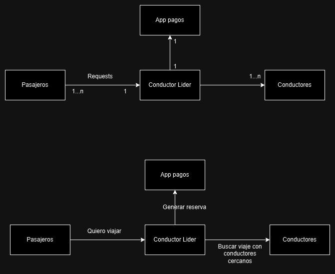

[](https://classroom.github.com/a/GAOi0Fq-)

# TP2

## Aplicaciones


## Esquema



## Actores

### Conductor
**Finalidad general:**
- Aceptar un viaje en rango, realizarlo e informar al cliente que terminó.

**Estado interno:**
- Esperando viaje, viajando


### Conductor Líder
**Finalidad general:**
- Deriva los pedidos de viaje a conductores que estén en el rango de salida. 
- Quita conductores que estén caídos (ver). 

**Estado interno:**
- Esperando viaje, viajando


### Pasajeros
**Finalidad general:**
- Encargados de pedir viajes al conductor líder y efectuar el pago?

**Estado interno:**
- Esperando viaje, pagando, viajando, terminado


### Pago
**Finalidad general:**
- Encargado de reservar y cobrar los montos de los viajes.

**Estado interno:**
- Cobrando, finalizando


```rust
pub struct Coordinates {
    pub x_origin: u16,
    pub y_origin: u16,
    pub x_dest: u16,
    pub y_dest: u16,
}
```


```rust
pub struct Passenger {
    /// The port of the passenger
    id: u16,
    /// The port of the leader (6000 for now)
    leader_port: u16,
    /// The actor that sends messages to the leader
    tcp_sender: Addr<TcpSender>,
    /// The list of rides (coordinates) that the passenger has to go to
    rides: Vec<Coordinates>,
    /// The channel to send a completion signal to the main function
    completion_signal: Option<Sender<()>>,
}
```

```rust
pub struct TcpSender {
    /// The write half of the TcpStream
    write: Option<WriteHalf<TcpStream>>,
}
```


```rust
pub struct Driver {
    /// The port of the driver
    pub id: u16,
    /// Whether the driver is the leader
    pub is_leader: Arc<RwLock<bool>>,
    // The connections to the drivers TODO
    pub drivers_connections: Arc<HashMap<u16, TcpStream>>,
}
```